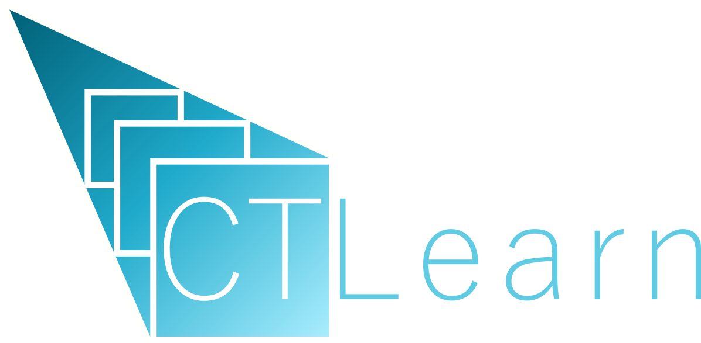

CTLearn: Deep Learning for IACT Event Reconstruction
====================================================

.. image:: https://zenodo.org/badge/DOI/10.5281/zenodo.11475531.svg
   :target: https://doi.org/10.5281/zenodo.11475531
   :alt: DOI

.. image:: https://img.shields.io/pypi/v/ctlearn
    :target: https://pypi.org/project/ctlearn/
    :alt: Latest Release

.. image:: https://github.com/ctlearn-project/ctlearn/actions/workflows/python-package-conda.yml/badge.svg
    :target: https://github.com/ctlearn-project/ctlearn/actions/workflows/python-package-conda.yml
    :alt: Continuos Integration
    

CTLearn is a package under active development to run deep learning models to analyze data from all major current and future arrays of imaging atmospheric Cherenkov telescopes (IACTs). CTLearn can load DL1 data from `CTA <https://www.cta-observatory.org/>`_ (Cherenkov Telescope Array), `FACT <https://www.isdc.unige.ch/fact/>`_\ , `H.E.S.S. <https://www.mpi-hd.mpg.de/hfm/HESS/>`_\ , `MAGIC <https://magic.mpp.mpg.de/>`_\ , and `VERITAS <https://veritas.sao.arizona.edu/>`_ telescopes processed by `ctapipe <https://github.com/cta-observatory/ctapipe>`_ or `DL1DataHandler <https://github.com/cta-observatory/dl1-data-handler>`_.

* Code, feature requests, bug reports, pull requests: https://github.com/ctlearn-project/ctlearn
* Documentation: https://ctlearn.readthedocs.io
* License: BSD-3

Installation for users
----------------------

Download and install `Anaconda <https://www.anaconda.com/download/>`_\ , or, for a minimal installation, `Miniconda <https://conda.io/miniconda.html>`_.

The following command will set up a conda virtual environment, add the
necessary package channels, and install CTLearn specified version and its dependencies:

.. code-block:: bash

   CTLEARN_VER=0.9.0
   wget https://raw.githubusercontent.com/ctlearn-project/ctlearn/v$CTLEARN_VER/environment.yml
   conda env create -n [ENVIRONMENT_NAME] -f environment.yml
   conda activate [ENVIRONMENT_NAME]
   pip install ctlearn==$CTLEARN_VER
   ctlearn -h

This should automatically install all dependencies (NOTE: this may take some time, as by default MKL is included as a dependency of NumPy and it is very large). If you are working on the IT-cluster, please use 'environment-cluster.yml' instead of 'environment.yml' in the instructions above.

See the documentation for further information like `installation instructions for developers <https://ctlearn.readthedocs.io/en/latest/installation.html#installing-with-pip-setuptools-from-source-for-development>`_, `package usage <https://ctlearn.readthedocs.io/en/stable/usage.html>`_, and `dependencies <https://ctlearn.readthedocs.io/en/stable/installation.html#dependencies>`_ among other topics.

Citing this software
--------------------

Please cite the corresponding version using the DOIs below if this software package is used to produce results for any publication:

.. |zendoi080| image:: https://zenodo.org/badge/DOI/10.5281/zenodo.11475531.svg
   :target: https://doi.org/10.5281/zenodo.11475531

* 0.8.0 : |zendoi080|

Team
----

.. list-table::
   :header-rows: 1

   * - .. image:: https://github.com/aribrill.png?size=100
        :target: https://github.com/aribrill
        :alt: Ari Brill
     
     - .. image:: https://github.com/bryankim96.png?size=100
        :target: https://github.com/bryankim96
        :alt: Bryan Kim
     
     - .. image:: https://github.com/TjarkMiener.png?size=100
        :target: https://github.com/TjarkMiener
        :alt: Tjark Miener
     
     - .. image:: https://github.com/nietootein.png?size=100
        :target: https://github.com/nietootein
        :alt: Daniel Nieto
     
   * - `Ari Brill <https://github.com/aribrill>`_
     - `Bryan Kim <https://github.com/bryankim96>`_
     - `Tjark Miener <https://github.com/TjarkMiener>`_
     - `Daniel Nieto <https://github.com/nietootein>`_

Collaborators
-------------

.. list-table::
   :header-rows: 1

   * - .. image:: https://github.com/qi-feng.png?size=100
        :target: https://github.com/qi-feng
        :alt: Qi Feng

     - .. image:: https://github.com/rlopezcoto.png?size=100
        :target: https://github.com/rlopezcoto
        :alt: Ruben Lopez-Coto

   * - `Qi Feng <https://github.com/qi-feng>`_
     - `Ruben Lopez-Coto <https://github.com/rlopezcoto>`_

Alumni
------

.. list-table::
   :header-rows: 1

   * - .. image:: https://github.com/Jsevillamol.png?size=100
        :target: https://github.com/Jsevillamol
        :alt: Jaime Sevilla
     
     - .. image:: https://github.com/hrueda25.png?size=100
        :target: https://github.com/hrueda25
        :alt: Héctor Rueda
     
     - .. image:: https://github.com/jredondopizarro.png?size=100
        :target: https://github.com/jredondopizarro
        :alt: Juan Redondo Pizarro
     
     - .. image:: https://github.com/LucaRomanato.png?size=100
        :target: https://github.com/LucaRomanato
        :alt: LucaRomanato
     
     - .. image:: https://github.com/sahilyadav27.png?size=100
        :target: https://github.com/sahilyadav27
        :alt: Sahil Yadav
     
     - .. image:: https://github.com/sgh14.png?size=100
        :target: https://github.com/sgh14
        :alt: Sergio García Heredia
     
   * - `Jaime Sevilla <https://github.com/Jsevillamol>`_
     - `Héctor Rueda <https://github.com/hrueda25>`_
     - `Juan Redondo Pizarro <https://github.com/jredondopizarro>`_
     - `Luca Romanato <https://github.com/LucaRomanato>`_
     - `Sahil Yadav <https://github.com/sahilyadav27>`_
     - `Sergio García Heredia <https://github.com/sgh14>`_
