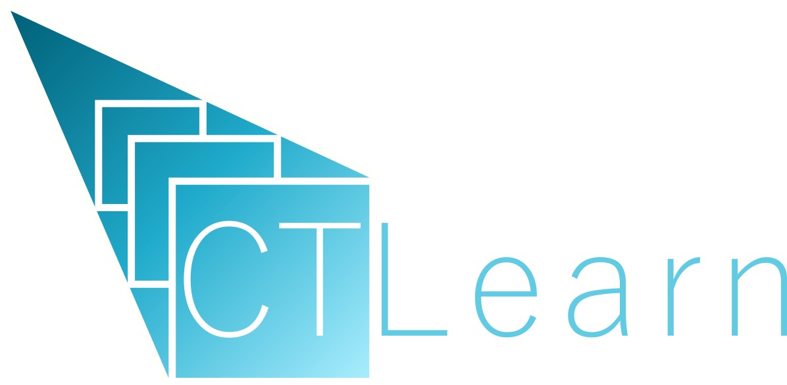

CTLearn: Deep Learning for IACT Event Reconstruction
====================================================

.. image:: https://zenodo.org/badge/DOI/10.5281/zenodo.3342952.svg
   :target: https://doi.org/10.5281/zenodo.3342952
   :alt: DOI

.. image:: https://img.shields.io/pypi/v/ctlearn
    :target: https://pypi.org/project/ctlearn/
    :alt: Latest Release

.. image:: https://github.com/ctlearn-project/ctlearn/actions/workflows/python-package-conda.yml/badge.svg
    :target: https://github.com/ctlearn-project/ctlearn/actions/workflows/python-package-conda.yml
    :alt: Continuos Integration
    

CTLearn is a package under active development to run deep learning models to analyze data from all major current and future arrays of imaging atmospheric Cherenkov telescopes (IACTs). CTLearn can load R1/DL0/DL1 data from `CTAO <https://www.cta-observatory.org/>`_ (Cherenkov Telescope Array Observatory), `FACT <https://www.isdc.unige.ch/fact/>`_\ , `H.E.S.S. <https://www.mpi-hd.mpg.de/hfm/HESS/>`_\ , `LST-1 <https://www.lst1.iac.es/>`_\ , `MAGIC <https://magic.mpp.mpg.de/>`_\ , and `VERITAS <https://veritas.sao.arizona.edu/>`_ telescopes reduced by `ctapipe <https://github.com/cta-observatory/ctapipe>`_ and processed by `DL1DataHandler <https://github.com/cta-observatory/dl1-data-handler>`_.

* Code, feature requests, bug reports, pull requests: https://github.com/ctlearn-project/ctlearn
* Documentation: https://ctlearn.readthedocs.io
* License: BSD-3

Installation for users
----------------------

Installation
------------

First, create and activate a fresh conda environment:

.. code-block:: bash

   mamba create -n ctlearn -c conda-forge python==3.12 llvmlite
   conda activate ctlearn

The lastest version fo this package can be installed as a pip package:

.. code-block:: bash

   pip install ctlearn

See the documentation for further information like `installation instructions for the IT-cluster <https://ctlearn.readthedocs.io/en/latest/installation.html#install-a-released-version>`_, `installation instructions for developers <https://ctlearn.readthedocs.io/en/latest/installation.html#installing-with-pip-setuptools-from-source-for-development>`_, `package usage <https://ctlearn.readthedocs.io/en/stable/usage.html>`_, and `dependencies <https://ctlearn.readthedocs.io/en/stable/installation.html#dependencies>`_ among other topics.

Running CTLearn Training and Prediction
---------------------------------------

CTLearn provides a unified command line interface (CLI) using `ctapipe`'s ``Tool`` and ``Component`` systems, supporting both the **Keras** and **PyTorch** deep learning frameworks.

Launching training
~~~~~~~~~~~~~~~~~~

You can launch a training run using the unified tool ``ctlearn-train``. To run with a specific framework, set the ``--framework`` option (choices: ``keras``, ``pytorch``):

.. code-block:: bash

   # Launch training with PyTorch
   ctlearn-train --framework=pytorch --output ./my_output_dir --signal /path/to/signal/h5/ --pattern-signal "*.dl1.h5" --reco energy --n_epochs=10 --batch_size=32

   # Launch training with Keras
   ctlearn-train --framework=keras --output ./my_output_dir --signal /path/to/signal/h5/ --pattern-signal "*.dl1.h5" --reco energy --n_epochs=10 --batch_size=32

Common Training Command Options:
* ``--framework``: Deep learning framework to use (``keras`` or ``pytorch``).
* ``-o``, ``--output``: Directory to save experiment checkpoints, parameters, and logs.
* ``--signal``: Directory containing signal HDF5 data files.
* ``--pattern-signal``: File name pattern for signal files (e.g. ``*.dl1.h5``).
* ``--reco``: Tasks to train (e.g. ``type``, ``energy``, ``cameradirection``, ``skydirection``). Multiple tasks can be provided.
* ``--n_epochs``: Number of epochs to train.
* ``--batch_size``: Batch size for training.
* ``--save_onnx=True``: Export the trained model to ONNX format.
* ``--load_onnx_model=PATH``: Load an existing ONNX model to train/fine-tune.
* ``--overwrite``: Overwrite the output directory if it already exists.

Launching prediction
~~~~~~~~~~~~~~~~~~~~

Similarly, predictions on test/observation data can be executed using the unified prediction tools (for monoscopic or stereoscopic mode):

.. code-block:: bash

   # Monoscopic prediction with PyTorch
   ctlearn-predict-mono-model --framework=pytorch --output ./pred_results --signal /path/to/test/h5/ --pattern-signal "*.dl1.h5" --energy_checkpoint /path/to/checkpoint.pth

   # Monoscopic prediction with Keras
   ctlearn-predict-mono-model --framework=keras --output ./pred_results --signal /path/to/test/h5/ --pattern-signal "*.dl1.h5" --energy_checkpoint /path/to/keras_model/

Citing this software
--------------------

Please cite the corresponding version using the `DOIs from Zenodo <https://zenodo.org/search?q=parent.id:3342952&sort=version&f=allversions:true>`_ if this software package is used to produce results for any publication.

Team
----

.. list-table::
   :header-rows: 1

   * - .. image:: https://github.com/aribrill.png?size=100
        :target: https://github.com/aribrill
        :alt: Ari Brill
     
     - .. image:: https://github.com/bryankim96.png?size=100
        :target: https://github.com/bryankim96
        :alt: Bryan Kim
     
     - .. image:: https://github.com/TjarkMiener.png?size=100
        :target: https://github.com/TjarkMiener
        :alt: Tjark Miener
     
     - .. image:: https://github.com/nietootein.png?size=100
        :target: https://github.com/nietootein
        :alt: Daniel Nieto
     
   * - `Ari Brill <https://github.com/aribrill>`_
     - `Bryan Kim <https://github.com/bryankim96>`_
     - `Tjark Miener <https://github.com/TjarkMiener>`_
     - `Daniel Nieto <https://github.com/nietootein>`_

Collaborators
-------------

.. list-table::
   :header-rows: 1

   * - .. image:: https://github.com/qi-feng.png?size=100
        :target: https://github.com/qi-feng
        :alt: Qi Feng

     - .. image:: https://github.com/rlopezcoto.png?size=100
        :target: https://github.com/rlopezcoto
        :alt: Ruben Lopez-Coto

   * - `Qi Feng <https://github.com/qi-feng>`_
     - `Ruben Lopez-Coto <https://github.com/rlopezcoto>`_

Alumni
------

.. list-table::
   :header-rows: 1

   * - .. image:: https://github.com/Jsevillamol.png?size=100
        :target: https://github.com/Jsevillamol
        :alt: Jaime Sevilla
     
     - .. image:: https://github.com/hrueda25.png?size=100
        :target: https://github.com/hrueda25
        :alt: Héctor Rueda
     
     - .. image:: https://github.com/jredondopizarro.png?size=100
        :target: https://github.com/jredondopizarro
        :alt: Juan Redondo Pizarro
     
     - .. image:: https://github.com/LucaRomanato.png?size=100
        :target: https://github.com/LucaRomanato
        :alt: LucaRomanato
     
     - .. image:: https://github.com/sahilyadav27.png?size=100
        :target: https://github.com/sahilyadav27
        :alt: Sahil Yadav
     
     - .. image:: https://github.com/sgh14.png?size=100
        :target: https://github.com/sgh14
        :alt: Sergio García Heredia
     
   * - `Jaime Sevilla <https://github.com/Jsevillamol>`_
     - `Héctor Rueda <https://github.com/hrueda25>`_
     - `Juan Redondo Pizarro <https://github.com/jredondopizarro>`_
     - `Luca Romanato <https://github.com/LucaRomanato>`_
     - `Sahil Yadav <https://github.com/sahilyadav27>`_
     - `Sergio García Heredia <https://github.com/sgh14>`_
