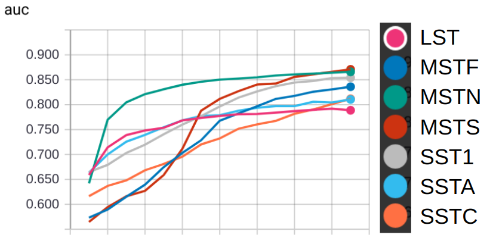
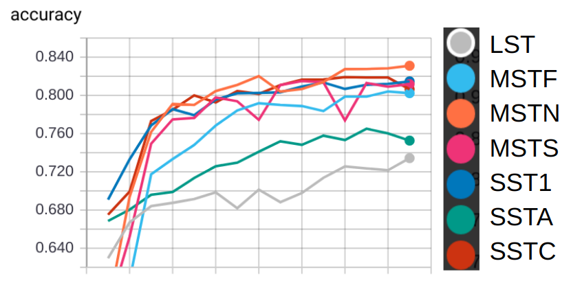
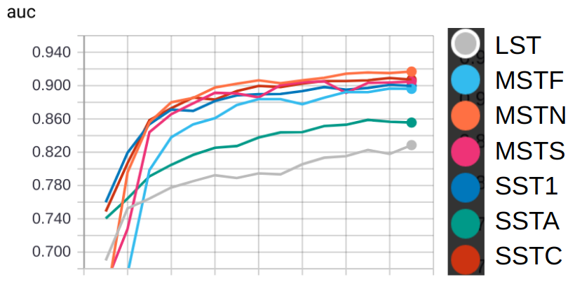

# CTLearn v0.2.0 Benchmarks

These configuration files and corresponding results show CTLearn's operation for training both single telescope and array models using simulations from all CTA telescopes. Since these results come from simple, minimally optimized models trained on a small dataset, they are meaningful only for demonstration and validation purposes and may not accurately reflect the performance of the various CTA telescopes. The metrics shown are calculated on a subset of the data withheld during training for validation, not on a separate test set. If retraining these models using the provided configuration files, note that while a seed is specified so the data will always be divided into the same training and validation sets, since batches of data are randomly shuffled during training, your results may slightly differ. The models were trained using a Nvidia Titan X Pascal GPU.

The config files for each telescope and network combination were generated by running [run_multiple_configurations.py](../../scripts/run_multiple_configurations.py) with benchmark_config.yml. The names of the generated config files have been changed for clarity, but the file contents have not been modified. To use these config files on your machine, change the following file paths as needed: Logging:model_directory, Data:file_list, Model:model_directory, Prediction:prediction_file_path, Multiple Configurations Settings:run_combinations_path, all paths to data files in prototype_files_class_balanced.txt (note that lines below 62 in that file are commented out).

## Single Telescope Validation Results

Telescope Type | Gamma Images | Proton Images | Validation Accuracy | Validation AUC | Training Time
---|---|---|---|---|---
LST|89165|90426|70.38%|0.7887|0h 41m 22s
MSTF|360787|379533|74.60%|0.8360|0h 55m 0s
MSTN|414502|443704|78.04%|0.8659|0h 58m 10s
MSTS|307498|294714|78.57%|0.8709|0h 59m 4s
SST1|213795|207996|77.11%|0.8542|0h 45m 30s
SSTA|221810|228042|72.59%|0.8105|0h 42m 17s
SSTC|217940|218312|73.90%|0.8118|0h 42m 4s

## CNN-RNN Validation Results

Telescope Type | Total Events | Validation Accuracy | Validation AUC | Training Time
---|---|---|---|---
LST|85401|73.43%|0.8285|0h 37m 14s
MSTF|249813|80.23%|0.8961|2h 6m 32s
MSTN|269362|83.10%|0.9169|2h 15m 52s
MSTS|223051|81.18%|0.9048|2h 37m 34s
SST1|197878|81.47%|0.8997|3h 21m 48s
SSTA|183669|75.27%|0.8556|2h 10m 55s
SSTC|190638|80.64%|0.9072|1h 51m 5s

