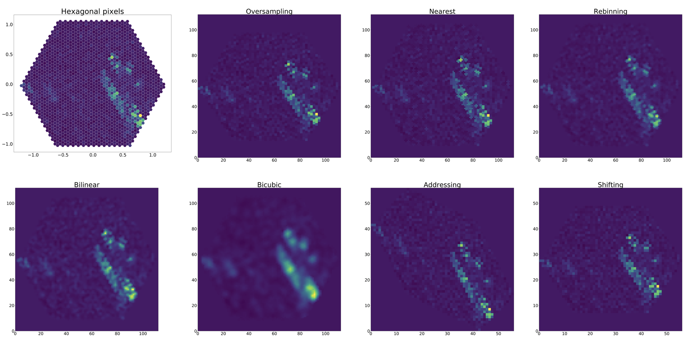
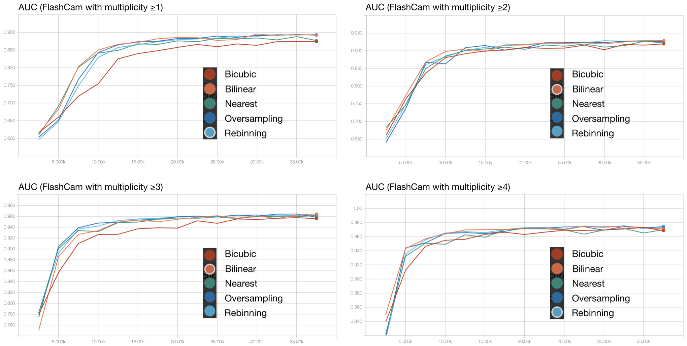

# CTLearn v0.3.0 Benchmarks

These configuration files can be used to show CTLearn's operation for training both single telescope and array models using simulations from all CTA telescopes. They reflect simple, minimally optimized models to be trained on a small dataset and so are meaningful only for demonstration and validation purposes and may not accurately reflect the performance of the various CTA telescopes. The metrics shown are calculated on a subset of the data withheld during training for validation, not on a separate test set. If retraining these models using the provided configuration files, note that while a seed is specified so the data will always be divided into the same training and validation sets, since batches of data are randomly shuffled during training, your results may slightly differ. The models were trained using a Nvidia Titan X Pascal GPU.

The config files for each conversion method and multipilicity cut (for FlashCam) were generated by running [run_multiple_configurations.py](../../scripts/run_multiple_configurations.py) with FlashCam_multiplicity_benchmark_config.yml. To use these config files on your machine, change the following file paths as needed: Logging:model_directory, Logging:scripts_directory, Data:file_list, Model:model_directory, Prediction:prediction_file_path, Multiple Configurations Settings:run_combinations_path, all paths to data files in prototype_files_class_balanced.txt (note that lines below 62 in that file are commented out).

## Conversion methods
- **Oversampling** converts each hexagonal pixel to four square pixels and reweight the charge to realign to a square grid in order to preserve the intensity.
- **Nearest interpolation** assign the pixel charge to the nearest neighbor of the square grid points.
- **Rebinning** interpret the intensity as a histogram and rebin the hexagonal histogram into a square one. Since our implementation approximately rebin the histogram, the intensity is only preserved to a certain point.
- For **bilinear** and **bicubic interpolation**, we add artificial pixels with zero intensity outside of the camera to draw Delaunay triangulation on the hexagonal grid. Then we perform bilinear and bicubic interpolation and norm the mapping tables, which approximately preserve the intensity.

The image below shows the impact of the different conversion methods on a simulated proton event captured by *FlashCam*.

## Comparing conversion methods using different multiplicity cuts for *FlashCam*

The results, shown in the table below, were obtained using the [CNN-RNN model](../../ctlearn/default_models/cnn_rnn.py). This model perform array-level classification by feeding the output of a CNN for each telescope into a recurrent neural network (RNN). The first value of each row correspond to the minimum number of triggered telescopes. The different multiplicity cuts result in a reduction of gamma and proton images. Each entry depicts the classification accuracy (ACC) and AUC, respectively. We performed this comparison using *FlashCam* and the runtime for all runs is around ~2h 10min.

Multiplicity | Oversampling | Nearest | Rebinning | Bilinear | Bicubic | Gamma Images | Proton Images 
---|---|---|---|---|---|---|---
1|79.65%/0.8932|77.05%/0.8769|**80.03%**/**0.8935**|79.81%/0.8915|77.78%/0.8739|121123|128690
2|83.16%/0.9260|83.29%/0.9223|83.33%/0.9273|**84.31%**/**0.9289**|82.98%/0.9195|77045|78517
3|88.83%/0.9585|89.41%/0.9616|89.27%/0.9618|**89.55%**/**0.9644**|88.59%/0.9556|50224|47192
4|91.67%/0.9735|90.70%/0.9697|**91.76%**/**0.9747**|91.68%/0.9710|90.44%/0.9684|31926|31795

